
 
  

  &#xa0;

  <!-- <a href="https://www.linkedin.com/in/danielwisouza/">LinkdeIn</a> -->

<h2 align="center">Projeto AdventureWorks</h2>

    <a href="https://www.linkedin.com/in/danielwisouza/">
        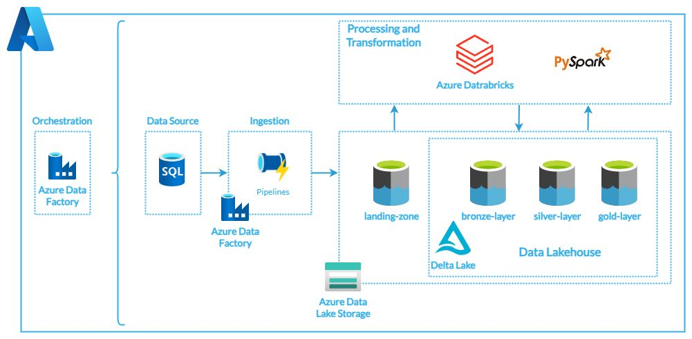  
    </a>

<!-- Status -->

<!-- <h4 align="center"> 
	🚧  Padronização De Readme De Projeto 🚀 Under construction...  🚧
</h4> 

 -->

  <a href="#dart-about">About</a> &#xa0; | &#xa0; 
  <a href="#rocket-technologies">Technologies</a> &#xa0; | &#xa0;
  <a href="#checkered_flag-starting">Projeto</a> &#xa0;  &#xa0;

 

## :dart: About ##
:construction_worker: **Engenharia de dados : Coletar, Tratar e disponibilizar o dado**  
:speech_balloon: **Analise de dados: Consumir, analisar e disponilizar os insight**

## :rocket: Technologies ##

The following tools were used in this project:
Neste projeto foram utilizadas as seguintes ferramentas:

:heavy_check_mark: Azure Blob Storage\
:heavy_check_mark: Azure Data Lake Storage - ADLS\
:heavy_check_mark: Azure Data Factory\
:heavy_check_mark: Data Flow\
:heavy_check_mark: Dedicated SQL Pool\
:heavy_check_mark: Servelees SQL Pool\
:heavy_check_mark: Apache Spark Pool\
:heavy_check_mark: Azure Data Bricks\
:heavy_check_mark: Precificação| Gerenciamento de custo + cobrança | Conta de cobrança\
:heavy_check_mark: Segurança | Assinaturas\
:heavy_check_mark: Gerenciamento de Recursos\
:heavy_check_mark: Engenharia de dados : Coletar, Tratar e disponibilizar o dado;\
:heavy_check_mark: Analise de dados: Consumir, analisar e disponilizar os insight;

## :checkered_flag: Projeto ##

:clock12: **Gerenciamento de Recursos**

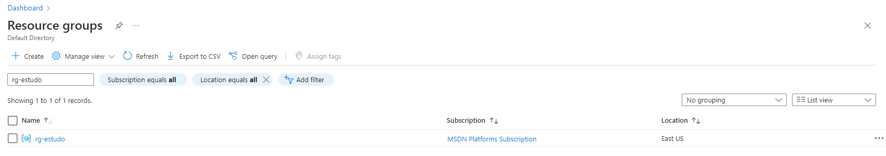

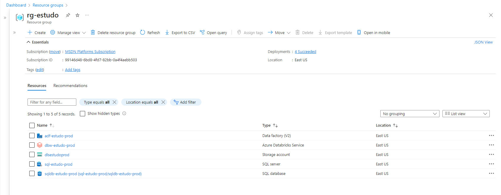

 

:file_folder: **Azure Data Lake Storage Gen2- ADLS**
Exemplo de execução, implementado pois data lake no formato delta.

 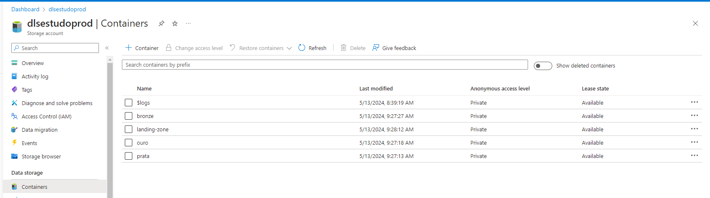
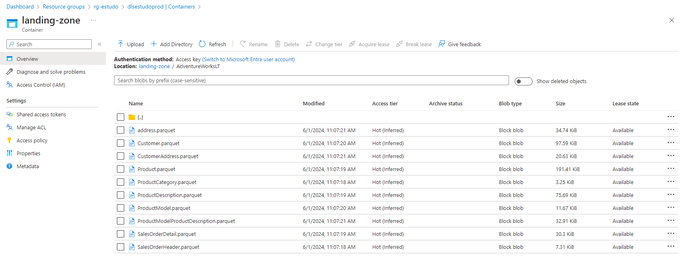

 

:sparkler: **Azure Data Factory**

 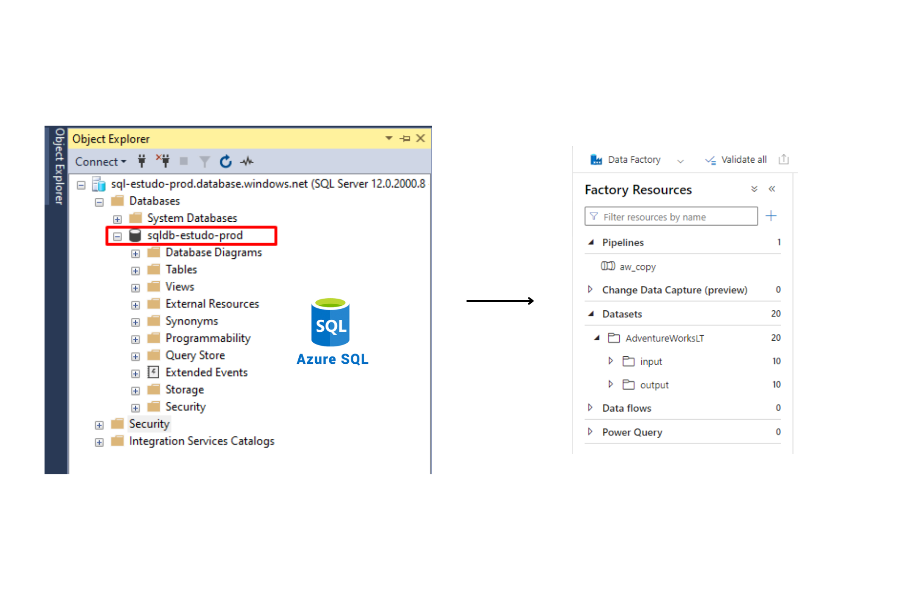
 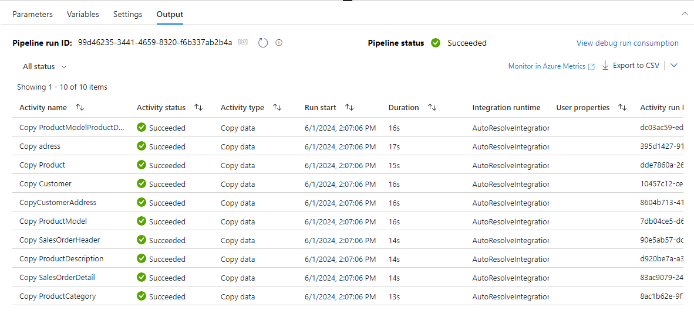

 

:sparkler: **Data Bricks**

 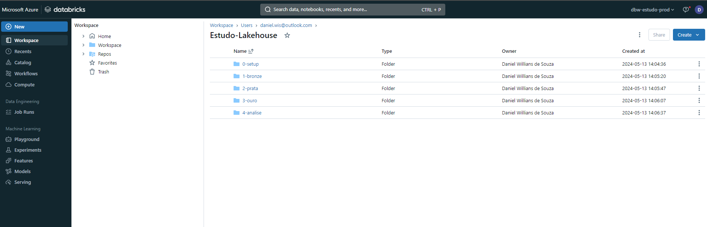

 

:books: **Criação de Servidores no Databricks**

 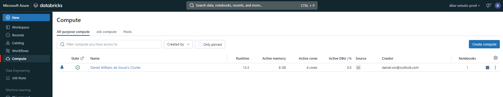
 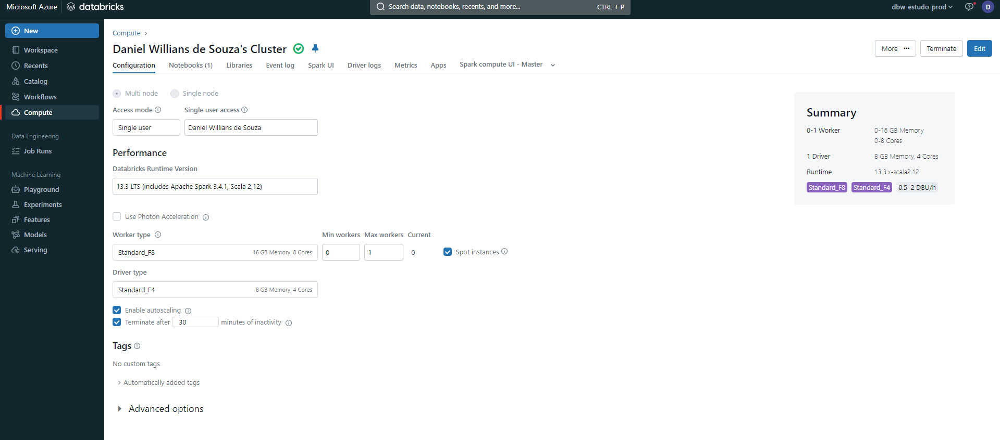

 

:books: **Integração ADLS com DataBricks Setup**

 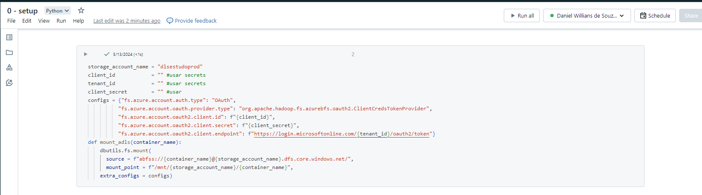
 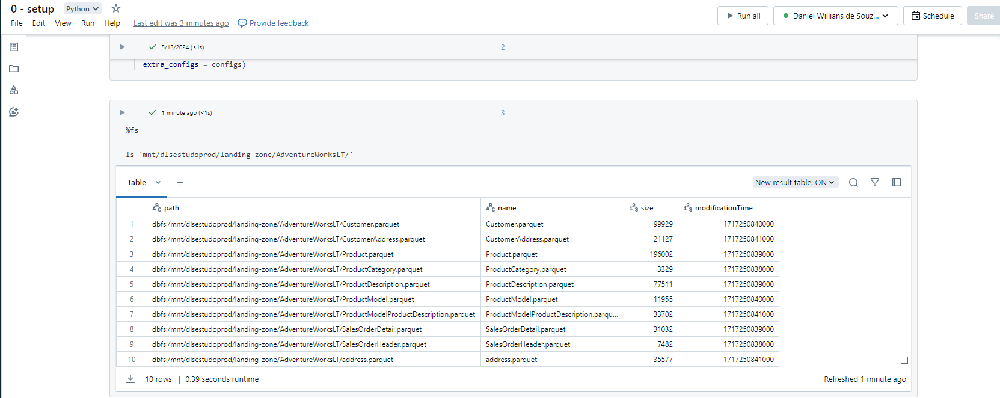

 

:books: **DataBricks Camandas Outro, Prata e Bronze**

 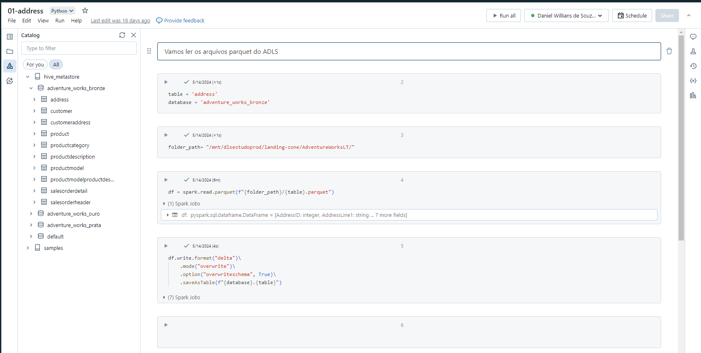

 

:books: **Análise - Integração Com Power BI**

Exemplo:
 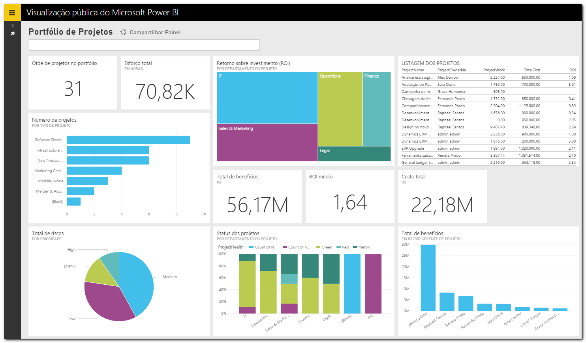

 

:moneybag: **Precificação| Gerenciamento de custo + cobrança | Conta de cobrança**

 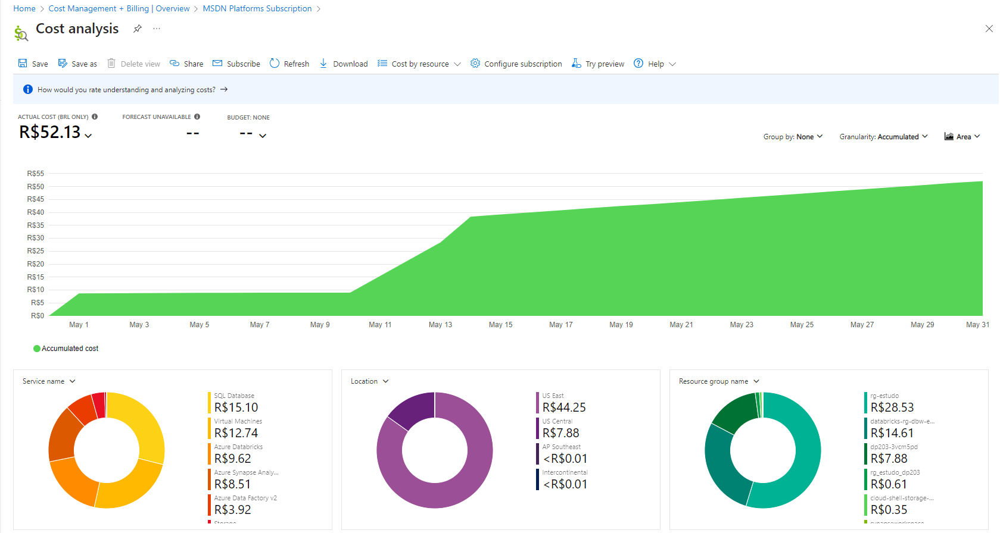

 

<a href="#top">Back to top</a>

