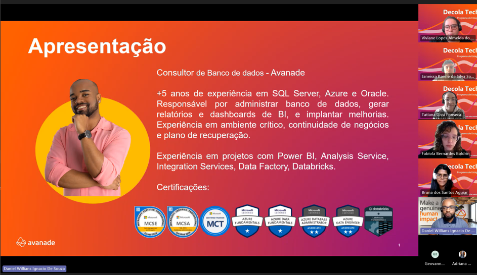
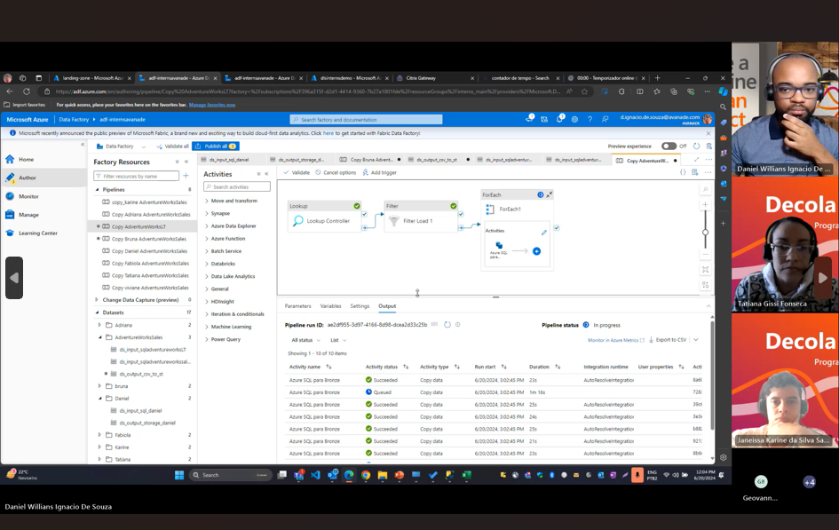

# 🚀 Data Engineer Training - AdventureWorks Project  
**EN 🇺🇸 | PT 🇧🇷**

  

---

## 📄 Meeting | Reunião

> **EN:** Screenshots from the project presentation meeting  
> **PT:** Prints da reunião de apresentação do projeto

  
  

---

## 📄 About the Project | Sobre o Projeto

> **EN:**  
This project simulates a complete **data engineering** pipeline in the **Azure** cloud ecosystem, covering data ingestion, transformation, storage, and visualization using the **Bronze, Silver, and Gold** layered architecture.

> **PT:**  
Este projeto simula um pipeline completo de **engenharia de dados** no ecossistema de nuvem **Azure**, abrangendo ingestão, transformação, armazenamento e visualização dos dados, utilizando a arquitetura em camadas **Bronze, Silver e Gold**.

### 🎯 Goals | Objetivos
- 🚀 Build a structured Data Lake using Delta format.  
- 🛠️ Create ingestion, transformation, and analysis pipelines.  
- 📊 Enable data visualization with Power BI.

---

## 🛠️ Technologies Used | Tecnologias Utilizadas

- Azure Blob Storage  
- Azure Data Lake Storage Gen2 (ADLS)  
- Azure Data Factory (ADF)  
- Data Flows  
- Dedicated SQL Pool  
- Serverless SQL Pool  
- Apache Spark Pool  
- Azure Databricks  
- Azure Cost Management  
- Azure Security & Resource Management

---

## 🧱 Architecture | Arquitetura

  

---

## ⚙️ Main Implementations | Principais Implementações

### 📂 Azure Resource Management | Gerenciamento de Recursos Azure
> **EN:** Organization and permission structure for project resources  
> **PT:** Organização e estrutura de permissões dos recursos do projeto

  
  

---

### 🛢️ Data Lake with Delta Format | Data Lake com Formato Delta

  
  

---

### 🔗 Data Ingestion with ADF | Ingestão de Dados com Azure Data Factory

  
  

---

### 🔥 Processing with Databricks | Processamento com Databricks

> **EN:** Implementation of **Medallion Architecture** using Spark  
> **PT:** Implementação da **Arquitetura Medallion** com Spark

  
  
  

#### 🔗 Databricks + ADLS Integration | Integração Databricks + ADLS

  
  

---

### 🏅 Bronze, Silver and Gold Layers | Camadas Bronze, Silver e Gold

  

---

### 📈 Power BI Visualization | Visualização com Power BI

  

---

### 💰 Cost Management | Gerenciamento de Custos

  

---

## 📬 Contact | Contato

---

[🔝 Back to top | Voltar ao topo](#)
